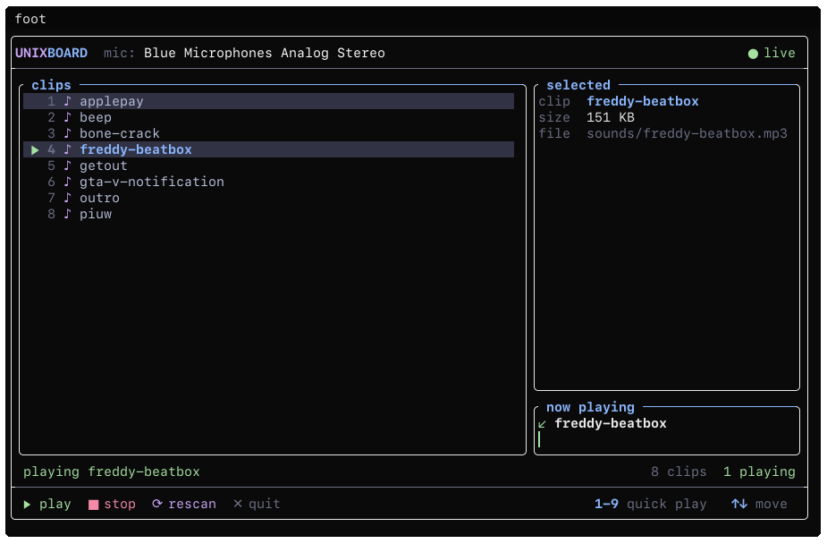

<div align="center">

# UnixBoard

**Terminal soundboard for your mic on Linux**

[](https://en.wikipedia.org/wiki/C%2B%2B17)
[](#status)
[](LICENSE)

</div>

A lightweight TUI for triggering sound clips straight into your microphone input on Linux. Pick a sound, click or hit a key, and it plays live :D



## Build

```sh
cmake -B build
cmake --build build -j
./build/unixboard
```
## License
This project is licensed under the GNU GPL v3.0. See the LICENSE file for details.
